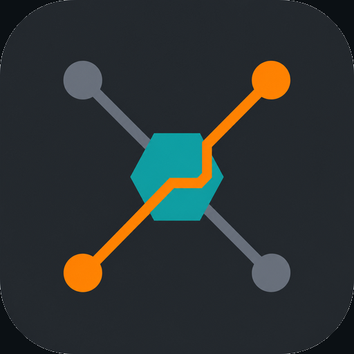

<!-- README-I18N:START -->
**English** | [简体中文](./README.zh-CN.md)
<!-- README-I18N:END -->

<div align="center">



# Nexus

**One client. Five platforms. Multi-node failover. Powered by sing-box.**

Cross-platform proxy client for self-hosted and subscription setups —
import nodes, autofix configs, connect, and keep traffic flowing with
Passwall-style automatic failover.

[](https://github.com/Jas0n0ss/nexus/actions/workflows/ci.yml)
[](https://github.com/Jas0n0ss/nexus/releases/latest)
[](#downloads)
[](LICENSE)
[](https://github.com/SagerNet/sing-box)

[Download](#downloads) · [Quick start](#quick-start) · [High availability](#high-availability) · [Build](app/BUILD.md)

</div>

---

## Features

- **Protocols** — VLESS / VMess / Trojan / Shadowsocks / Hysteria2 / TUIC / WireGuard  
- **Import** — subscription URL, share URI, Clash YAML, sing-box JSON, local file  
- **Autofix** — ALPN / SNI / encryption / REALITY defaults on import  
- **Routing** — rule / global / direct (+ optional ads block)  
- **HA failover** — probe active node → switch backups → restore primary (Passwall-inspired)  
- **Platforms** — macOS · Windows · Linux · iOS · Android  

Inspired by [OpenWrt Passwall](https://github.com/Openwrt-Passwall/openwrt-passwall) autoswitch logic
(`socks_auto_switch`: probe URL, backup list, restore primary, offline detection).

---

## High availability

When **Auto failover** is enabled (default):

1. Every ~30s, probe `generate_204` through the local mixed port  
2. If the probe fails but the device still has network → try the next node  
3. Candidates = primary + other imported nodes (latency-ordered)  
4. Optional **restore primary** when the original node recovers  

Settings → *Automation · HA*.

---

## Downloads

| Platform | Package |
|----------|---------|
| macOS | `.dmg` |
| Windows | Setup / portable ZIP |
| Linux | AppImage / `.deb` / `.rpm` |
| Android | Universal APK (recommended) |
| iOS | Unsigned IPA (sideload) |

**Releases:** https://github.com/Jas0n0ss/nexus/releases/latest  

Push to `main` → auto version bump + Release (keeps latest **2**).  
PR CI builds artifacts only.

**Trusted installers** (no Gatekeeper / SmartScreen warnings) require platform
certificates as GitHub Secrets — see [docs/TRUSTED_BUILDS.md](docs/TRUSTED_BUILDS.md)
and [docs/CODE_SIGNING.md](docs/CODE_SIGNING.md).  
Android can use a generated keystore today; macOS/Windows need paid Apple / CA certs.

---

## Quick start

```bash
bash app/scripts/fetch_singbox.sh
cd app && flutter pub get && flutter run
```

1. Import a subscription or URI  
2. Latency-test nodes  
3. Connect — failover watches the session in the background  

---

## Development

| Doc | Topic |
|-----|--------|
| [app/BUILD.md](app/BUILD.md) | Build matrix & cores |
| [docs/TRUSTED_BUILDS.md](docs/TRUSTED_BUILDS.md) | Secrets for trusted packages |
| [docs/CODE_SIGNING.md](docs/CODE_SIGNING.md) | Developer ID / Authenticode |
| [STRUCTURE.md](STRUCTURE.md) | Repository map |
| [nexus-preview.html](nexus-preview.html) | Static UI preview |

---

## License

[MIT](LICENSE)
